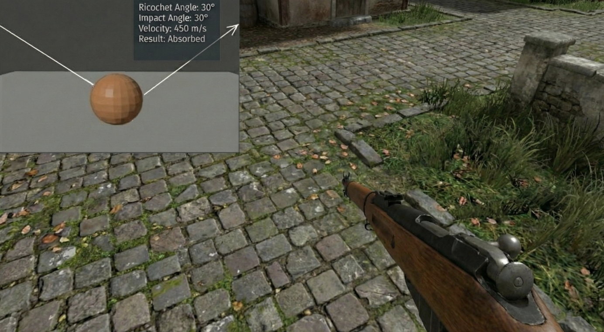

Ricochet Physics Simulation

This project is a 3D first-person simulation built from scratch using C++ and OpenGL. It demonstrates a custom physics implementation for ballistics, specifically focusing on projectile reflection (ricochets), energy absorption, and collision detection against environmental geometry.
The archived repository [here](https://github.com/soyuznik/OpenGL-First-Person-Shooter) contains more changes that happened before this one.
Visual Overview

<table>
<tr>
<th width="33%">High-Angle Ricochet</th>
<th width="33%">Velocity Absorption</th>
<th width="33%">Vector Calculation</th>
</tr>
<tr>
<td></td>
<td></td>
<td></td>
</tr>
<tr>
<td>
<b>Weapon:</b> Assault Rifle

Demonstrates projectile reflection on steep angles. The engine calculates the surface normal at the impact point to reflect the velocity vector.

</td>
<td>
<b>Weapon:</b> Bolt-Action Rifle

Simulation of energy loss. The HUD displays real-time metrics (Angle: 30°, Velocity: 450 m/s) to determine if the bullet deflects or is absorbed by the material.

</td>
<td>
<b>Debug View</b>

Visualizes the vector math. White debug lines render the <b>Incident Vector</b> (incoming) and <b>Reflection Vector</b> (outgoing) in real-time.

</td>
</tr>
</table>

Technical Features

1. Custom Physics Engine

AABB Collision Detection: Uses Axis-Aligned Bounding Boxes for efficient intersection testing between the player, environment, and projectiles.

Ray-Segment Casting: Bullets are modeled as moving line segments rather than simple raycasts. This prevents "tunneling" (bullets passing through walls) at high velocities by checking for collisions along the entire travel path between frames.

Reflection Math: Collision response uses the reflection vector formula $R = I - 2(I \cdot N)N$ to accurately bounce projectiles off surfaces based on impact angle and surface normals.

2. Rendering & Assets

Asset Import (Assimp): Integrates the Open Asset Import Library (Assimp) to load complex 3D models (OBJ format) for weapons (M4A1, Deagle) and environmental assets.

Shader Pipeline: Custom vertex and fragment shaders handle lighting, texture mapping, and perspective projection.

Texture Management: Uses stb_image for loading textures with support for alpha channels and mipmapping.

3. Audio & Feedback

FMOD Integration: Implements the FMOD audio engine for 3D spatial sound, managing separate channel groups for background music and weapon effects.

Procedural Animation: Features procedural gun sway and recoil, along with sprite-sheet based muzzle flash animations blended into the 3D scene.

Dependencies

GLFW: Window creation and input handling.

GLAD: OpenGL function pointer loading.

GLM: Mathematics library for vectors and matrices.

Assimp: Open Asset Import Library for loading 3D models.

FMOD: Audio engine.

stb_image: Image loading.